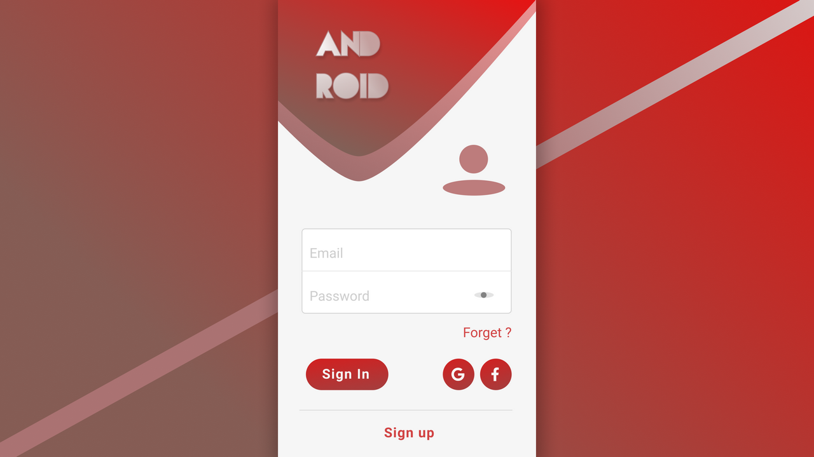

# Android-Login-UI

<!-- PROJECT LOGO -->
 

  

  <h3 align="center">ThenisH</h3>

  

     
    <a href="https://youtu.be/dZB7HdCVQvg"> Part 1</a>
    ·
    <a href="https://youtu.be/uYVGYueS2tQ"> Part 2</a>
  

<!-- ABOUT THE PROJECT -->
## Example

